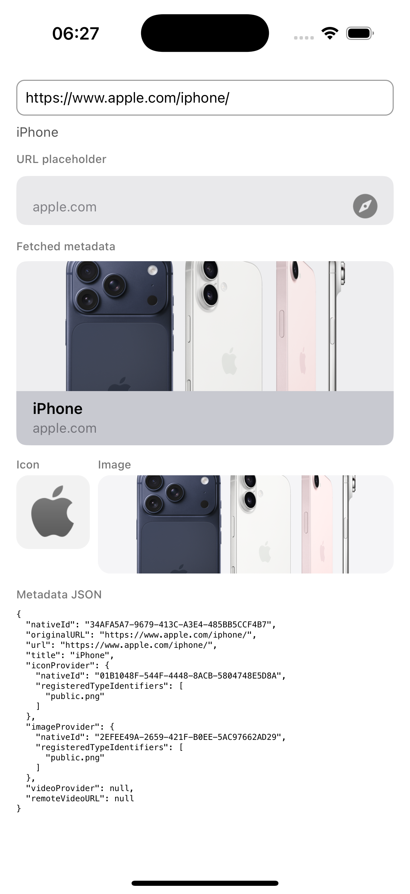

<h1 align="center">
  
  React Native LinkPresentation
</h1>

<p align="center">
  React Native binding to Apple's <a href="https://developer.apple.com/documentation/linkpresentation">LinkPresentation</a> framework
</p>

<p align="center">
  
</p>

iOS performs every fetch, redirect, metadata extraction, and item-provider load. The package performs no JavaScript networking or metadata parsing.

Requires iOS 15.1+ and React Native 0.76+. Both the legacy and new React Native architectures are supported.

## Demo

<table>
  <tr>
    <td></td>
    <td></td>
    <td></td>
    <td></td>
  </tr>
  <tr>
    <td align="center">Apple</td>
    <td align="center">TikTok</td>
    <td align="center">YouTube</td>
    <td align="center">TikTok long press</td>
  </tr>
</table>

## Installation

```sh
npm install @andreywtf/react-native-link-presentation
cd ios && pod install
```

The package is iOS-only. It can be imported on other platforms, but functions reject with `E_UNSUPPORTED_PLATFORM` and `LPLinkView` renders nothing.

## Quick start

```tsx
import {
  getLinkMetadata,
  LPLinkView,
} from '@andreywtf/react-native-link-presentation';

const metadata = await getLinkMetadata('https://www.apple.com/iphone/');

<LPLinkView metadata={metadata} style={{ height: 180 }} />;
```

## Documentation

- [JavaScript API reference](docs/api.md)
- [Usage examples](docs/examples.md)

## Development

The LinkPresentation implementation and native view are written in Swift. Small Objective-C++ adapters remain where React Native's generated TurboModule and Fabric interfaces require C++/Objective-C++ entry points.

```sh
npm install
npm run lint
npm run typecheck
npm test
npm run build

cd example
npm install
cd ios && pod install
open LinkPresentationExample.xcworkspace
```

The example demonstrates native fetching, cancellation, custom metadata, placeholders, rich views, and lazy item-provider materialization.
